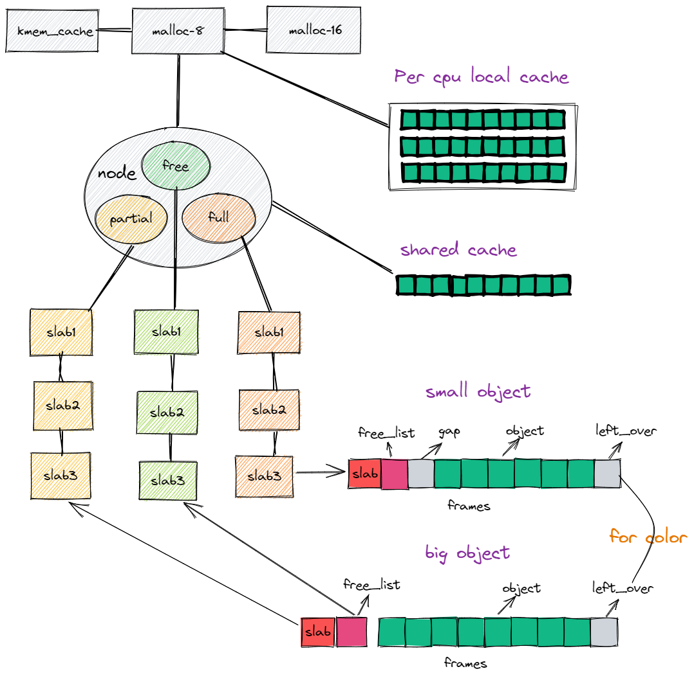

# slab分配器实现

## 模型结构



## 对外接口

```rust
pub fn init_slab_system(frame_size: usize, cache_line_size: usize) 
```

此函数用于初始化slab系统，用户需要告知slab系统分配的页帧大小和缓存行大小，页帧大小用于计算对象数量，缓存行大小用于着色偏移计算。slab系统会完成第一个Cache的初始化并创建多个常用大小的Cache,这些cache对象的大小从8B-8MB

```rust
pub fn create_mem_cache(name:&str,size:u32,align:u32,)->Result<Error,& mut Cache>
```

上述函数用来供使用者创建一个自定义名称和大小的`Cache` ，当创建失败会得到错误提示，使用者可根据此错误重新创建，常见的错误有重命名。

```rust
impl Cache{
    pub fn alloc(&self)->Result<Error,*mut u8>
    pub fn dealloc(&self)->Result<Error,_>
    pub fn destory(&self)->Result<Error,_> 
}
```

使用者拿到创建的Cache后，可以直接从这个cache中获取对象而不通过下面提到的`alloc_from_slab`函数，在使用完后，可以调用`destory`删除这个cache，此时如果再用这个cache分配会发生错误。

```rust
pub fn reclaim_frame_from_cache()-->usize
```

slab系统并不会直接回收空闲页面，需要外部的页帧管理器在感知到存在页面压力时调用这个函数尝试从Slab系统中回收页面,函数返回值为回收的页面数量。

```rust
pub fn alloc_from_slab(size: usize, _align: usize) -> Option<*mut u8> 
pub fn dealloc_to_slab(addr: *mut u8)
```

slab系统提供了分配内存和回收内存的接口，且在内部实现了一个`SlabAllocator`，其实现了GlobalAlloc接口，因此使用者可以直接使用此实现提供`#[global_allocator]`,当然也可以根据上面这两个函数实现自己的内存分配器。

```rust
pub fn print_slab_system_info()
```

这个函数用于打印slab系统的使用情况。

## 对内接口

外部需要提供的接口：

```rust
pub fn alloc_frames(num:usize)->*mut u8
pub fn free_frames(addr: *mut u8, num: usize) 
pub fn current_cpu_id() -> usize
```

外部需要提供一个分配页面的接口和回收页面的接口以及一个获取当前cpu的id的接口。


## 使用方式

1. 首先实现外部需要提供的两个接口

```rust
#[no_mangle]
fn alloc_frames(num: usize) -> *mut u8 
#[no_mangle]
fn free_frames(addr: *mut u8, num: usize) 
#[no_mangle]
pub fn current_cpu_id() -> usize
```

2. 初始化slab子系统

```rust
init_slab_system(FRAME_SIZE, 32);
```

3. 在rust中，声明全局全局分配器

```rust

#[global_allocator]
static HEAP_ALLOCATOR: SlabAllocator = SlabAllocator::new();
```

现在可以就可以正常使用slab子系统提供的分配和回收物理内存的功能了。

在内核的文件模块，进程模块，都可以为既定的结构体创建一个Cache,并使用此Cache分配对象。

```rust
pub struct Process{
    id:usize
}
lazy_static! {
    pub static ref PROCESS_CACHE: Mutex<&'static mut MemCache> = {
        let cache = create_mem_cache("process".as_bytes() ,core::mem::size_of::<Process>() as u32,
        core::mem::align_of::<Process>() as u32).unwrap();
        Mutex::new(cache)
    };
}
```

## 待办事项

- [x] 多核，每CPU缓存
- [x] 细粒度的锁
- [ ] 其它优化

## 细节

- 在对象不小于页面1/8的情况下，尝试将slab描述符放置在外部，将所有页面用来存放对象。

在这种情况下，可能会造成无法着色的情况？ 对于那些被页大小整除/整除页大小的

- 思考如何根据对象大小，对齐方式计算出所需要的页帧数量，对齐大小？碎片的占用率<12.5%

方法：

1. 从0往上增大物理页帧的阶数
2. 对于对象大小<1/8页面的对象来说，直接将slab描述符与对象放在页面中
3. 对于大于1/8页面的对象，其描述符放置在单独的区域
4. 计算内碎片大小，如果内碎片占比<12.5%退出
5. 否则继续增大阶数


