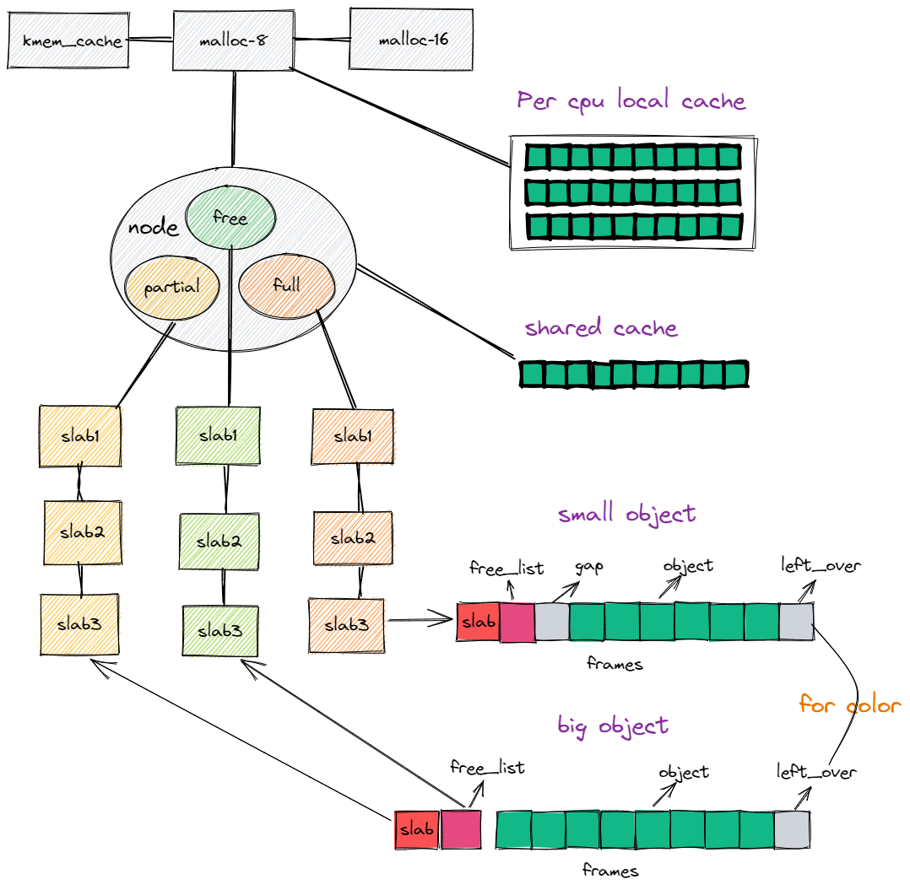

# slab分配器实现

## 模型结构



## 对外接口

```rust
pub fn init_slab_system(frame_size: usize, cache_line_size: usize) 
```

此函数用于初始化slab系统，用户需要告知slab系统分配的页帧大小和缓存行大小，页帧大小用于计算对象数量，缓存行大小用于着色偏移计算。slab系统会完成第一个Cache的初始化并创建多个常用大小的Cache,这些cache对象的大小从8B-8MB

```rust
pub fn print_slab_system_info()
```

这个函数用于打印slab系统的使用情况。


## 对内接口

外部需要提供的接口：

```rust
pub fn alloc_frames(num:usize)->*mut u8
pub fn free_frames(addr: *mut u8, num: usize) 
pub fn current_cpu_id() -> usize
```

外部需要提供一个分配页面的接口和回收页面的接口以及一个获取当前cpu的id的接口。


## 使用方式

1. 首先实现外部需要提供的两个接口

```rust
#[no_mangle]
fn alloc_frames(num: usize) -> *mut u8 
#[no_mangle]
fn free_frames(addr: *mut u8, num: usize) 
#[no_mangle]
pub fn current_cpu_id() -> usize
```

2. 初始化slab子系统

```rust
init_slab_system(FRAME_SIZE, 32);
```

3. 在rust中，声明全局全局分配器

```rust
#[global_allocator]
static HEAP_ALLOCATOR: SlabAllocator = SlabAllocator;
```

现在可以就可以正常使用slab子系统提供的分配和回收物理内存的功能了。

在内核的文件模块，进程模块，都可以为既定的结构体创建一个Cache,并使用此Cache分配对象。


## 待办事项

- [x] 每CPU缓存
- [x] 细粒度的锁
- [ ] 其它优化

## 细节

